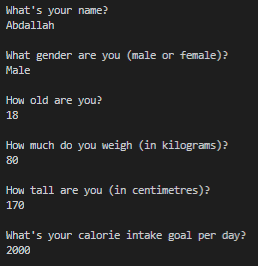
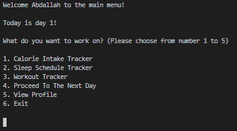
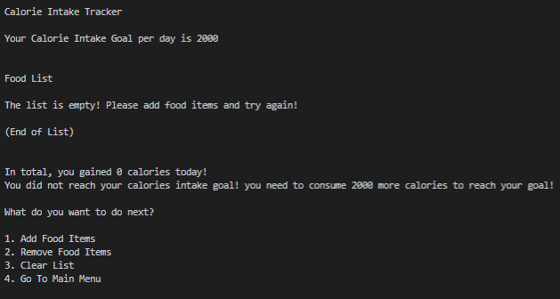
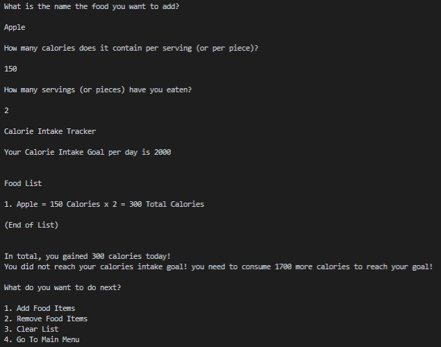
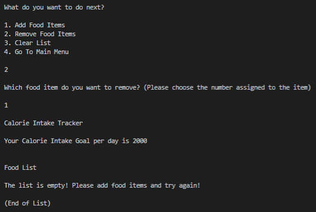
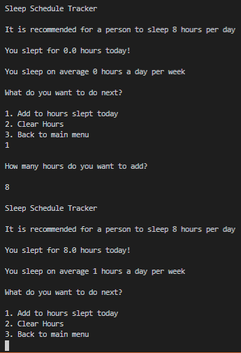
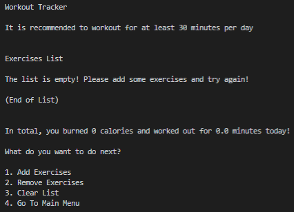
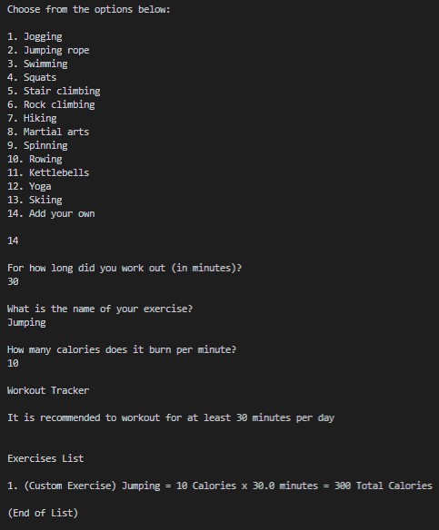
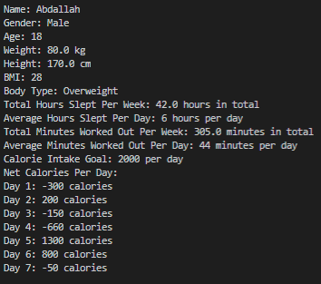

# Java Lifestyle Tracker
> A lifestyle tracker created in 2020 as my project for the Java OOP course in the British University in Dubai.

> Java was used in this project.

> The lifestyle tracker is entirely operated on the terminal.

> Run the Application.java to start.

> Day.java and User.java are used to create the classes used in the program.

> The lifestyle tracker has 3 main functionalities which are calorie intake tracker, sleep schedule tracker, and workout tracker.

> The user can also view thier profile to check on thier basic information, thier net calorie intake of each day, and other information such as the BMI, body type, and the total and average hours slept and minutes worked out.

> The program starts by asking the user thier basic information.

> 

> Then, the user will be taken to the main menu.

> 

> In this menu, the user can choose betwen the different functionalities that the program has to offer.

> In the Calorie Intake Tracker, a list is shown of all the food items consumed that day.

> Users can add or remove items from the list or clear out the whole list.

> 

> This is how it looks when adding an item.

> 

> This is how it looks when removing an item.

> 

> In the Sleep Tracker, the user can add or clear out the amount of hours they slept.

> 

> In the Workout Tracker, the user can add and remove exercises from a list.

> The list can also be cleared.

> 

> Here is an example of an exercise being added to the list.

> 

> Finally, the user can view thier profile to check out thier statistics, basic information, and other information they might need.

> 

> An issue with this project is that it does not contain any comments however the code is readable enought to be utilized.

> Most of my code up until this point might seem very unorganized since it was still the start of my programming journey.

> Enjoy :)
